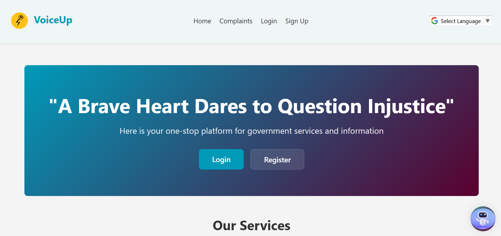

# 🗣️ VoiceUp – Government Complaint Portal

VoiceUp is a modern, AI-powered web application designed to streamline communication between citizens and government authorities. Citizens can file and track complaints effortlessly, while administrators and officers can manage and resolve issues efficiently.



---

## 🌟 Features

### 👤 User Authentication
- Citizen signup and login
- Admin & officer accounts with role-based access
- Secure password hashing with bcrypt
- Session management using JWT

### 📝 Complaint Management
- File new complaints with categories (e.g., Water, Roads, Electricity)
- Mark urgency levels (Low, Medium, High)
- Track real-time status
- Add updates/comments
- Complaint history view

### 📊 Admin Dashboard
- View and manage all user accounts
- Create and assign officer accounts
- Monitor complaints by category or urgency
- Update complaint statuses and assign responsibilities
- Real-time graphs and statistics for complaint tracking and user activity

### 🤖 AI-Powered Assistance
- **Google Gemini AI Integration**
  - Auto-categorisation of complaints
  - Smart chat support for citizens and officers

### 🌐 Multi-language Support
- Supports translation to multiple Indian languages for wider accessibility

### 🎨 Modern UI
- Responsive, mobile-friendly design
- Built with **Tailwind CSS** and **EJS Templates**
- Clean, intuitive interface for seamless navigation

---

## 🧱 Tech Stack

| Layer      | Tech Used                                |
|------------|-------------------------------------------|
| **Frontend** | EJS, Tailwind CSS, Express-EJS-Layouts   |
| **Backend**  | Node.js, Express.js, MongoDB             |
| **Auth**     | JWT Authentication, Bcrypt               |
| **AI**       | Google Gemini API                        |

---

## 📸 Screenshots

###  Complaints received 


###  Admin Dashboard


###  Gemini AI Chat Interface


---

## ⚙️ Installation

### Prerequisites
- Node.js (v14+)
- MongoDB installed locally or use MongoDB Atlas
- Google Gemini API key
### Setup

```bash
# Clone the repository
git clone https://github.com/prasanth-42/VoiceUp.git

# Install dependencies
npm install

# Create environment variables
echo "GEMINI_API_KEY=your_gemini_api_key" > .env

# Start MongoDB (if local)
mongod

# Run the application
node app.js
```

🖥️ Visit: `http://localhost:3000`


## 🔌 API Endpoints

| Endpoint                  | Method | Description                              |
|---------------------------|--------|------------------------------------------|
| `/api/chat`               | POST   | Ask questions to Gemini AI               |
| `/complaints`             | POST   | File a new complaint                     |
| `/my-complaints`          | GET    | View logged-in user's complaints         |
| `/update-complaint-status`| POST   | Admin/Officer update complaint status    |

---

## 🔒 Security

- Password hashing with **bcrypt**
- JWT-based secure authentication
- Role-based access control
- Input sanitisation and validation
- Secure cookies for session handling

---

## 🤝 Contributing

We welcome contributions!

1. Fork the repo
2. Create a new branch: `git checkout -b feature/YourFeature`
3. Commit your changes: `git commit -m "Add YourFeature"`
4. Push to the branch: `git push origin feature/YourFeature`
5. Submit a Pull Request 🚀

---

## 📜 License

Licensed under the [MIT License](LICENSE).

---

## 🙋 Support

For support, suggestions, or queries, feel free to connect with me on [LinkedIn](https://www.linkedin.com/in/krprasanth/)
